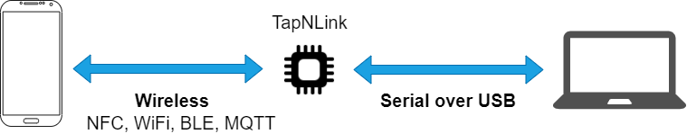
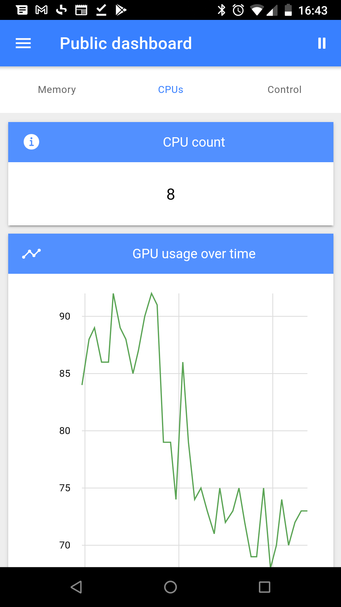
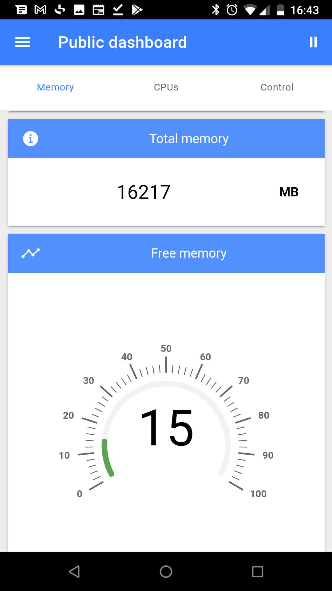
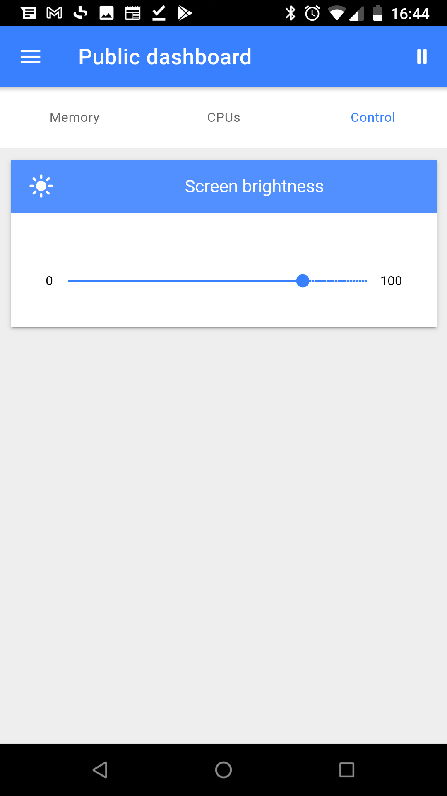

# TAP USB dongle demo

This project contains source for the TAP USB dongle demonstration. Control/monitor your PC with an auto generated mobile application through a Tapioca USB-to-Wireless dongle.



It's composed of 3 projects:
 
- **app**: Source for the mobile application built with Ionic. It was auto generated by IoTize mobile app build server.
- **modbus-slave**: Source for the modbus slave application for `node`. This modbus application will listen for modbus request on the given serial port (See Modbus registers defined in annex).
- **tap-config/modbus-slave-demo.iotz**: IoTize Studio configuration file to configure the `Tapioca` for the demo.


### Run the demo

1. Plugin the Tapioca USB dongle to your PC
2. Open `tap-config/modbus-slave-demo.iotz` with IoTize Studio. If you don't have it yet, [it's here](http://docs.iotize.com/UserManuals/IotizeStudio/);
3.  Configure your `Tapioca` with `IoTize Studio`
    1.  [Setup connection to your Tap](http://docs.iotize.com/UserManuals/DiverseTools/)
    2.  Click on `Configure` button and wait for the end of the configuration process.
4. Start the Modbus Slave application:

Go to `modbus-slave` directory and run commands:

```bash
npm install
npm start
```

*Note*: `node` and `npm` are required (tested with `node` version `>=10`). If you don't have node, see [node installation page](https://nodejs.org/en/download/)

5. Install client application on your phone:
   
   1. **Android**: [build/app-debug.apk](build/app-debug.apk)
   2. **iOS**: build from the ionic sources in the app folder. See [Ionic documentation](https://ionicframework.com/docs/developing/ios)

6. Run the mobile application, connect to the `Tapioca` and start monitoring hard drive usage, CPU usage and control screen luminosity with your phone.

|           |   | |
|-------------------------|-------------------------|-------------------------|
 |  |  |


# Annex

## Modbus slave application registers

### Holding registers

| Address | Size | Content |
| --- | --- | --- |
| 0x002 | 1 Word | Hard drive memory free in MB |
| 0x004 | 1 Word | Total hard drive memory in MB |
| 0x009 | 1 Word | Percentage of free memory |
| 0x006 | 1 Word | Number of CPUs |
| 0x00B | 1 Word | CPU usage (in %) |
| 0x100 | 1 Word | Screen brightness in % |
